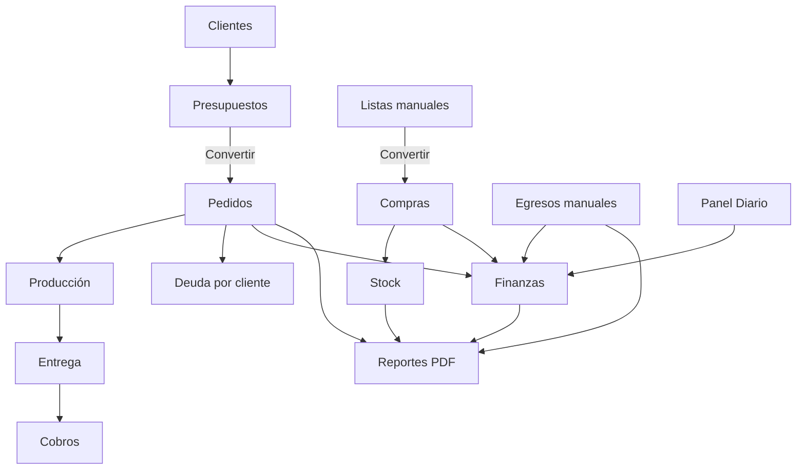

# PACKYA System Documentation

## 1) Objetivo, alcance y estado actual

Este documento describe el estado actual real del sistema PACKYA en la base de código actual (sin supuestos de funcionalidades futuras), con foco en:

- Módulos funcionales activos.
- Modelo de datos persistido en localStorage.
- Flujo operativo de negocio (cliente -> presupuesto -> pedido -> producción -> entrega -> cobro -> cierre).
- Motor documental PDF (todos los documentos detectados y su origen de datos).
- Diferencia entre datos existentes y datos efectivamente impresos.

### 1.1 Stack y runtime

- Frontend: React.
- Bundler: Vite.
- Desktop shell: Electron.
- Router: HashRouter.
- Persistencia principal: localStorage.
- Documentos PDF: jsPDF.
- Sincronización cloud: hooks por dominio (snapshot sync) con allowlist en capa app.

### 1.2 Configuración global observada

Fuente: src/config/app.js

- name: Packya Gestión
- version: 3.0.0
- company: Packya
- printingBaseCost: 100
- environment: VITE_APP_ENV (fallback local)

### 1.3 Módulos de navegación activos

Rutas registradas en App:

- /dashboard
- /panel-diario
- /finanzas
- /pedidos
- /presupuestos
- /archivados
- /clientes
- /productos
- /compras
- /listas-compra
- /reportes
- /base-datos
- /configuracion
- /stock

---

## 2) Arquitectura funcional y responsabilidades por módulo

## 2.1 Pedidos

Responsabilidad principal:

- Alta/edición operativa de pedidos.
- Estado de producción y entrega.
- Registro de pagos y ajustes financieros.
- Archivado automático condicionado por estado + deuda.

Reglas clave observadas:

- Estados normales: Pendiente, En Proceso, Listo, Entregado, Cancelado.
- Estados muestra: Pendiente, Lista.
- Pedidos muestra:
- No facturables.
- No aceptan pagos.
- Se autoarchivan al pasar a Lista.
- Pedido Entregado solo se autoarchiva si deuda remanente = 0.

## 2.2 Presupuestos

Responsabilidad principal:

- Crear y gestionar presupuestos sin impacto directo en stock/finanzas.
- Convertir presupuesto a pedido.

Reglas clave observadas:

- Estado derivado Vencido si status base Pendiente y validUntil < hoy.
- Conversión a pedido:
- Si ya existe pedido con sourceQuoteId, se reutiliza y marca presupuesto como Aceptado.
- Si no hay clientId en presupuesto, exige alta manual de cliente para convertir.
- Conversión crea pedido con skipStockImpact: true.

## 2.3 Clientes

Responsabilidad principal:

- Maestra de clientes.
- Observaciones críticas/no críticas.
- Cuenta corriente por pedidos.
- Imputación de cobros por pedido y ajustes administrativos.

Reglas clave observadas:

- Normalización de teléfono a dígitos.
- creditBalance nunca negativo.
- paymentAllocations persistidas por cliente.

## 2.4 Productos

Responsabilidad principal:

- Catálogo de productos.
- Costos/precios de referencia.
- Stock histórico por movimientos.

Reglas clave observadas:

- Categorías canónicas: CAJA, BOLSA, EMBALAJE, OTRO.
- stockTotal se recalcula desde stockMovements (no es valor libre).
- Tipos de movimiento permitidos: Ajuste, Compra, Devolución, Venta, Muestra.

## 2.5 Compras

Responsabilidad principal:

- Registro de compras por proveedor.
- Ingreso de stock automático por ítem comprado.
- Actualización de costos de referencia en flujo app.

Reglas clave observadas:

- paymentMethod forzado a Transferencia.
- lineTotal por ítem con descuentos.
- createPurchase llama callback de stock para cada ítem.

## 2.6 Listas manuales de compra

Responsabilidad principal:

- Prearmado interno de listas de compra.
- Conversión a compra real.

Reglas clave observadas:

- Estados: Pendiente, Convertida, Cancelada.
- Solo lista Pendiente puede convertirse.
- Conversión exige proveedor y al menos un ítem con productId.

## 2.7 Finanzas

Responsabilidad principal:

- Resumen diario y mensual de caja.
- Egresos manuales (empresa/socio).
- Rentabilidad mensual y movimientos consolidados.

Reglas clave observadas:

- Egreso empresa requiere categoría.
- Egreso socio requiere person (FRANCO o DAMIAN).
- Movimiento mensual mezcla cobros de pedidos + compras + egresos manuales.

## 2.8 Panel Diario

Responsabilidad principal:

- Apertura/cierre diario multicuenta.
- Ingresos/egresos con trazabilidad (pedido/proveedor/actor/fondo).
- Informe mensual ejecutivo avanzado PDF.

Fondos canónicos:

- cash
- mercadoPagoFranco
- mercadoPagoDamian

Reglas clave observadas:

- Cierre valida consistencia mínima de movimientos.
- Diferencia de cierre = realFinal - expectedFinal.
- Estado visual diario: vacío, abierto, cerrado correcto, cerrado con diferencia.

## 2.9 Stock

Responsabilidad principal:

- Ajustes manuales de stock.
- Historial de movimientos.
- Cálculo de faltantes por pedidos activos.
- Planes de compra acumulados.

Reglas clave observadas:

- Faltantes usa pedidos no archivados con estados operativos.
- Permite construir plan mixto: recomendaciones + carga manual.

## 2.10 Reportes

Responsabilidad principal:

- Exportación PDF transversal:
- Lista de precios
- Costos
- Deudas
- Estado de cuenta cliente
- Stock
- Egresos
- Producción

---

## 3) Modelo de datos real (persistencia y campos)

## 3.1 Claves localStorage principales

Desde backup/configuración/estados:

- packya_orders
- packya_products
- packya_clients
- packya_suppliers
- packya_purchases
- packya_purchase_plans
- packya_expenses
- packya_manual_purchase_lists
- packya_quotes
- packya_daily_panel_entries_v1
- packya_storage_version
- packya_orders_safety_snapshot_v1 (snapshot seguridad pedidos)

## 3.2 Entidad Pedido

Campos observados en normalización y alta:

- id
- clientId
- clientName
- client
- status
- createdAt
- productionDate
- readyAt
- deliveryDate (YYYY-MM-DD)
- deliveredVia
- deliveryType
- deliveredBy
- trackingNumber
- deliveryNote
- deliveryDetails
- productionTime
- sourceQuoteId
- shippingCost
- financialNote
- discount
- urgent
- isSample
- isArchived
- archivedAt
- items[]
- payments[]
- financialAdjustments[]
- total

Subestructura items[]:

- productId
- productName
- quantity
- unitPrice
- isClientMaterial
- itemCompleted

Subestructura payments[]:

- id
- amount
- method (Efectivo/Transferencia/MercadoPago)
- date
- note
- orderId (al registrar)
- clientId (al registrar)
- allocationBatchId (si fue pago distribuido)
- allocationOrder
- isAutoAllocated
- clientPaymentAmount
- overpayCredit

Subestructura financialAdjustments[]:

- id
- amount (admite positivo/negativo)
- note
- date

## 3.3 Entidad Cliente

- id
- name
- phone (normalizado a dígitos)
- email
- address
- notes
- observations[]
- creditBalance
- paymentAllocations[]
- createdAt

Subestructura observations[]:

- id
- text
- createdAt
- isCritical

Subestructura paymentAllocations[]:

- id
- amount
- method
- createdAt
- note
- overpayCredit
- allocations[] (orderId, amount)

## 3.4 Entidad Producto

- id
- name
- category
- stockTotal (recalculado)
- stockMinimo
- referenceCost
- salePrice
- image (data:image/...)
- usageCount
- lastUsedAt
- stockMovements[]

Subestructura stockMovements[]:

- id
- type (Ajuste/Compra/Devolución/Venta/Muestra)
- amount (con signo)
- reason
- date

## 3.5 Entidad Compra

- id
- supplierId
- supplierName
- items[]
- totalAmount
- paymentMethod (Transferencia)
- supplier
- createdAt

Subestructura items[]:

- productId
- productName
- quantity
- unitCost
- discountFixed
- discountPercent
- appliedDiscount
- lineTotal

## 3.6 Entidad Proveedor

- id
- name
- phone
- notes
- createdAt

## 3.7 Entidad Presupuesto

- id
- clientId
- clientName
- clientSource (existing/manual/none)
- productionLeadTime
- deliveryType
- shippingCost
- validUntil
- createdAt
- status
- items[]
- subtotal
- total

Subestructura items[]:

- id
- sourceMode
- productId
- description
- quantity
- unitPrice
- lineTotal

## 3.8 Entidad Egreso

- id
- type (empresa/socio)
- person (FRANCO/DAMIAN o null)
- amount
- category
- reason
- description
- date (YYYY-MM-DD)
- note
- createdAt

## 3.9 Entidad Lista Manual de Compra

- id
- supplierId
- supplierName
- createdAt
- status
- items[]
- estimatedTotal

Subestructura items[]:

- productId
- productName
- quantity
- referenceCost
- lineTotal

## 3.10 Entidad Plan de Compra (stock)

- id
- createdAt
- products[]
- totalEstimado

Subestructura products[]:

- productId
- productName
- demandTotal
- stockActual
- faltante
- sugeridoComprar
- unitCost
- costoEstimado

## 3.11 Entidad Panel Diario (día)

- dateKey
- openingBalances { cash, mercadoPagoFranco, mercadoPagoDamian }
- closingBalances { cash, mercadoPagoFranco, mercadoPagoDamian }
- incomeMovements[]
- expenseMovements[]
- operational {
- ordersTaken
- ordersDelivered
- paymentsRegistered
- productionActivity
- printedBoxes
- }
- notes
- openingNote
- closingNote
- isClosed
- closedAt
- openedAt
- createdAt
- updatedAt

Subestructura movement (income/expense):

- id
- concept
- amount
- category
- origin
- fundId
- actor
- linkedOrderId
- unlinkReason
- supplierName
- note
- isAdvancePayment
- isCompact

---

## 4) Flujo operativo end-to-end (real)

## 4.1 Flujo macro

1. Cliente
2. Presupuesto
3. Conversión a pedido (opcional)
4. Pedido y producción
5. Entrega
6. Cobro / imputación
7. Cierre operativo diario y mensual
8. Reportería documental

## 4.2 Presupuesto -> Pedido

- Presupuesto se crea con items, deliveryType, validUntil y costos.
- No mueve stock ni finanzas.
- Al convertir:
- Si presupuesto ya convertido (sourceQuoteId ya presente en pedidos), no duplica pedido.
- Si cliente no existe por id, se pide carga manual (nombre/teléfono obligatorio en modal de conversión).
- Se crea pedido con status Pendiente y sourceQuoteId.

## 4.3 Pedido -> Stock

- Al crear pedido normal, App aplica movimientos de stock tipo Venta por ítem (excepto material de cliente).
- Al crear muestra, aplica tipo Muestra (excepto material de cliente).
- Si pedido se creó desde presupuesto convertido, usa skipStockImpact true.

## 4.4 Pedido -> Entrega -> Archivo

- updateOrderStatus permite transición a Entregado.
- Autoarchivo:
- Entregado + deuda 0 => archivado true.
- Entregado + deuda > 0 => permanece activo.
- Muestra en Lista => archivada automáticamente.

## 4.5 Cobranza

- registerPayment: pago directo por pedido (no permite superar deuda).
- registerClientPayment: distribuye pago de cliente entre pedidos con deuda por prioridad temporal.
- Si sobra monto: se informa overpayCredit en resultado de asignación.

## 4.6 Producción y métricas

- Producción en reportes se calcula principalmente sobre pedidos Entregado y cantidades en ítems.
- Panel Diario añade perspectiva por día (readyAt/productionDate y cajas impresas).

## 4.7 Egresos

- Egreso manual en Finanzas entra a packya_expenses.
- También impacta el consolidado mensual financiero y reportes.

## 4.8 Cierre diario y mensual

- Panel Diario centraliza apertura/cierre por fondo.
- Cierre mensual PDF toma el agregado del mes y produce indicadores directivos, trazabilidad y series históricas.

---

## 5) Inventario completo de documentos PDF activos

## 5.1 Documentos operativos (src/utils/pdf.js)

1. Orden de trabajo
- Función: generateOrderPDF
- Archivo: Orden_Trabajo_{cliente}_{YYYY-MM-DD}.pdf
- Fuente principal: entidad pedido + resumen financiero.

2. Estado de cuenta por cliente (ficha cliente)
- Función: generateClientStatementPDF
- Archivo: {cliente-sanitizado}-estado-cuenta.pdf
- Fuente principal: cliente + pedidos asociados.

3. Plan de compra acumulado (stock)
- Función interna: createPurchasePlanDoc
- Salidas:
- downloadPurchasePlanPDF => guarda archivo.
- openPurchasePlanPDF => abre blob en nueva ventana.
- Archivo: {plan.id}.pdf
- Fuente principal: plan armado en módulo stock.

4. Presupuesto
- Función: generateQuotePDF
- Archivo: Presupuesto_{cliente}_{YYYY-MM-DD}.pdf
- Fuente principal: entidad presupuesto.

5. Lista manual de compra
- Función: generateManualPurchaseListPDF
- Archivo: {list.id}.pdf
- Fuente principal: entidad lista manual.

## 5.2 Documentos de reportes (src/utils/reportsPdf.js)

6. Lista de precios
- Función: generatePriceListPDF
- Archivo: Packya-ListaPrecios-{YYYY-MM-DD}.pdf

7. Reporte de costos
- Función: generateCostsPDF
- Archivo: Packya-Costos-{YYYY-MM-DD}.pdf

8. Reporte de deudas
- Función: generateDebtPDF
- Archivo: Packya-Deudas-{YYYY-MM-DD}.pdf

9. Estado de cuenta cliente (masivo)
- Función: generateClientAccountPDF
- Archivo: Packya-EstadoCuenta-{YYYY-MM-DD}.pdf

10. Estado de stock
- Función: generateStockStatusPDF
- Archivo: Packya-Stock-{YYYY-MM-DD}.pdf

11. Reporte de egresos
- Función: generateExpensesReportPDF
- Archivo: Packya-Egresos-{YYYY-MM-DD}.pdf

12. Reporte de producción
- Función: generateProductionReportPDF
- Archivo: Packya-Produccion-{YYYY-MM-DD}.pdf

13. Informe mensual ejecutivo del Panel Diario
- Función: generateDailyPanelMonthlyReportPDF
- Archivo: Packya-InformeMensual-{monthKey}.pdf

---

## 6) Campos manuales vs automáticos

## 6.1 Manuales (usuario)

Pedidos (form):

- Selección de cliente o nombre de muestra.
- Teléfono de muestra.
- Estado inicial.
- Fecha de entrega.
- Nota financiera.
- Descuento.
- Ítems (producto, cantidad, precio unitario, material cliente).
- Fecha de creación / fecha de producción.
- Flag muestra.

Presupuestos:

- Cliente existente o manual.
- Ítems y precios.
- Tiempo de producción.
- Tipo de entrega.
- Costo de envío.
- Fecha de validez.

Clientes:

- Nombre, teléfono, email, dirección, notas.
- Observaciones.

Productos:

- Nombre, categoría.
- Stock mínimo.
- Costo referencia, precio venta.
- Imagen.

Compras:

- Proveedor.
- Ítems de compra y costos.

Egresos:

- Tipo empresa/socio.
- Socio (si aplica).
- Categoría.
- Monto.
- Motivo.
- Fecha.
- Nota.

Panel diario:

- Aperturas/cierres por fondo.
- Movimientos ingreso/egreso (concepto, monto, actor, origen, vínculo, proveedor, nota).
- Notas del día.

## 6.2 Automáticos (sistema)

- IDs de entidades (PED-, COT-, SUP-, EXP-, MPL-, PLAN-, etc).
- createdAt / updatedAt cuando no se informa.
- Subtotales/totales calculados en presupuestos, compras, listas, PDFs.
- lineTotal por ítem.
- status derivado Vencido para presupuestos.
- Autoarchivo de pedidos según deuda y estado.
- Validación y normalización de teléfonos, fechas, estados y categorías.
- Movimientos sugeridos del Panel Diario desde Pedidos/Compras/Gastos.
- Derivación de métricas (deuda, margen, score, trazabilidad, concentración, capacidad).

---

## 7) Matriz Campo | Documento | Origen del dato

Nota: la matriz incluye los campos más relevantes y/o repetidos en documentos. El origen indica entidad y cálculo.

| Campo impreso | Documento | Origen del dato |
| --- | --- | --- |
| ID pedido | Orden de trabajo | order.id |
| Cliente | Orden de trabajo | order.clientName / order.client |
| Teléfono cliente | Orden de trabajo | order.phone / order.clientPhone |
| Email cliente | Orden de trabajo | order.email / order.clientEmail |
| Estado pedido | Orden de trabajo | order.status + mapeo getOrderStatusBadge |
| Fecha emisión | Orden de trabajo | order.createdAt formateada |
| Fecha entrega | Orden de trabajo | order.deliveryDate |
| Ítems (producto, descripción, cantidad, medida, diseño, precio unitario, subtotal) | Orden de trabajo | order.items -> paginateOrderItemRows/buildOrderItemTableRows |
| Subtotal / descuento / total final | Orden de trabajo | getOrderFinancialSummary(order) |
| Total abonado / deuda / estado financiero | Orden de trabajo | getOrderFinancialSummary(order) |
| Observaciones | Orden de trabajo | order.financialNote |
| Tipo de trabajo marcado | Orden de trabajo | getWorkTypeSelections(order.items) |
| Cuentas de transferencia | Orden de trabajo y Presupuesto | constantes TRANSFER_ACCOUNTS |
| Contacto y web | Orden de trabajo y Presupuesto | constantes PACKYA_PHONE_NUMBER / PACKYA_WEBSITE_URL |
| Cliente | Presupuesto | quote.clientName |
| Estado presupuesto | Presupuesto | quote.status + validUntil (estado efectivo) |
| Validez | Presupuesto | quote.validUntil |
| Tiempo producción | Presupuesto | quote.productionLeadTime |
| Tipo entrega | Presupuesto | quote.deliveryType |
| Costo envío | Presupuesto | quote.shippingCost (si Envío) |
| Detalle ítems presupuesto | Presupuesto | quote.items[] |
| Subtotal / total / anticipo mínimo | Presupuesto | cálculo local subtotal + shipping + total*0.5 |
| ID lista manual | Lista manual de compra PDF | list.id |
| Proveedor lista manual | Lista manual de compra PDF | list.supplierName |
| Fecha lista manual | Lista manual de compra PDF | list.createdAt |
| Ítems (producto, cantidad) | Lista manual de compra PDF | list.items[] |
| ID plan compra | Plan de compra PDF | plan.id |
| Fecha plan compra | Plan de compra PDF | plan.createdAt |
| Producto/demanda/stock/faltante/sugerido/costo | Plan de compra PDF | plan.products[] |
| Total estimado plan | Plan de compra PDF | plan.totalEstimado |
| Total facturado histórico | Estado de cuenta cliente (pdf.js) | suma totals por pedidos del cliente |
| Total pagado histórico | Estado de cuenta cliente (pdf.js) | suma paid por pedidos del cliente |
| Total pendiente histórico | Estado de cuenta cliente (pdf.js) | suma debt por pedidos del cliente |
| Detalle pedidos con saldo | Estado de cuenta cliente (pdf.js) | rows de pedidos con debt > 0 |
| Producto y precio unitario | Lista de precios | rows provenientes de productos seleccionados |
| Costo/precio/margen/margen% | Reporte de costos | rows calculadas en ReportsPage |
| Cliente/deuda/pedidos/días deuda | Reporte de deudas | debtRows en ReportsPage |
| Estado de cuenta mensual por cliente | Estado de cuenta (reportsPdf) | accountRows agregadas por mes |
| Producto/stock actual | Estado de stock | stockRows en ReportsPage |
| Fecha/tipo/socio/categoría/motivo/monto | Reporte de egresos | expensesRows |
| Resumen por socio y categoría | Reporte de egresos | agregaciones expensesSummaryByPartner/Category |
| Producción por mes y categoría | Reporte de producción | productionRows en ReportsPage |
| KPIs ejecutivos mensuales | Informe mensual Panel Diario | monthMetrics + monthReportAnalytics |
| Trazabilidad ingresos/egresos | Informe mensual Panel Diario | analytics incomeTraceability/expenseTraceability |
| Packya Score + breakdown | Informe mensual Panel Diario | cálculo scoreBreakdown y scoreValue |
| Histórico 12 meses | Informe mensual Panel Diario | historical12Months |
| Detalle diario del mes | Informe mensual Panel Diario | dailyRows |

---

## 8) Datos existentes no impresos, controles y riesgos de consistencia

## 8.1 Datos relevantes existentes que no siempre se imprimen

Pedidos:

- deliveredVia
- deliveredBy
- trackingNumber
- deliveryNote / deliveryDetails
- urgent
- sourceQuoteId
- itemCompleted por ítem
- archivedAt

Clientes:

- observations completas con isCritical
- creditBalance
- paymentAllocations detalladas

Productos:

- usageCount
- lastUsedAt
- stockMovements completos (solo algunos reportes muestran resumen)

Panel Diario:

- openingNote y closingNote
- unlinkReason por ingreso no vinculado
- supplierName y actor por egreso
- isCompact/isAdvancePayment (metadatos de edición)

## 8.2 Controles automáticos de calidad observados

- Normalización de entidades al cargar desde storage.
- Filtros anti-nulos para arrays persistidos.
- Validación de estructura de backup antes de restaurar.
- Snapshot de seguridad de pedidos antes de cambios.
- Guardado debounced en órdenes/productos.
- Reglas de cierre diario con validación de inconsistencias.

## 8.3 Riesgos funcionales detectables (documentación operativa)

- Doble fuente de verdad visual para estado de cuenta:
- Existe un PDF por cliente en pdf.js.
- Existe otro PDF de estado de cuenta en reportsPdf.js.
- Riesgo: divergencia de formato/reglas si no se mantienen en paralelo.

- Conversión presupuesto -> pedido con skipStockImpact:
- Diseñado explícitamente para evitar doble impacto inmediato.
- Requiere disciplina operativa para mantener coherencia stock-proceso.

- Datos ricos no impresos por defecto:
- Hay más granularidad en storage que en salidas PDF (ej. tracking/delivery/metadatos diarios).
- Esto es normal, pero puede generar necesidad de anexos si auditoría crece.

## 8.4 Mapa textual general del sistema

## 8.5 Resumen ejecutivo final

- El sistema opera con arquitectura local-first y dominio fuertemente normalizado por hooks de estado.
- El circuito comercial principal (presupuesto -> pedido -> cobro) está implementado con reglas explícitas de deuda/archivo.
- El circuito de stock integra compras, ventas, muestras y ajustes con historial de movimientos por producto.
- El circuito documental PDF está ampliamente cubierto: 13 tipos de documento activos detectados.
- El Panel Diario funciona como capa de control directivo y produce el informe mensual más profundo del sistema.
